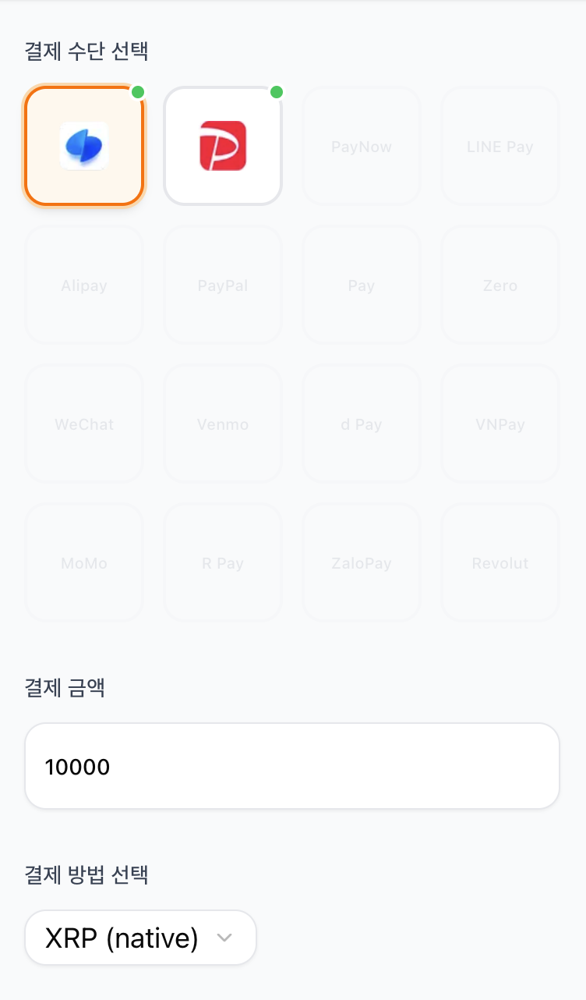
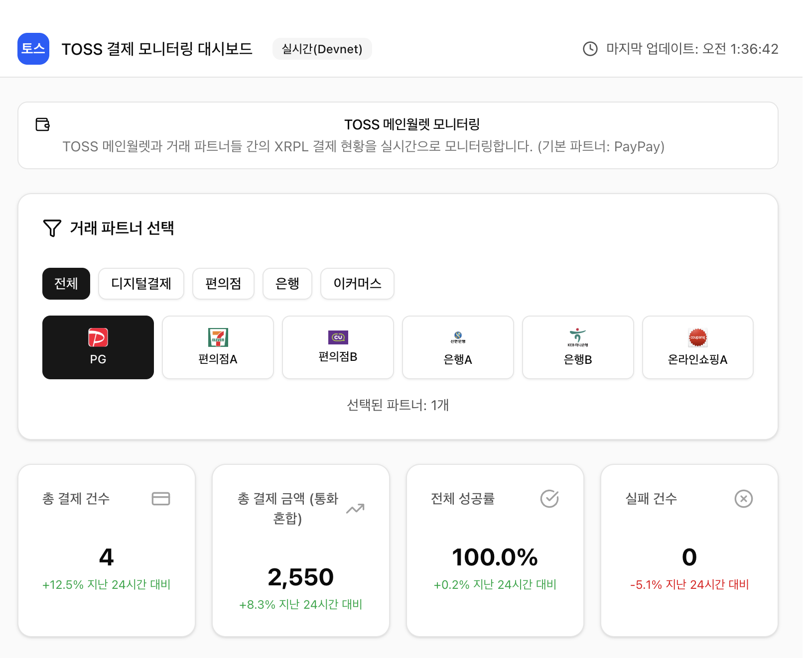
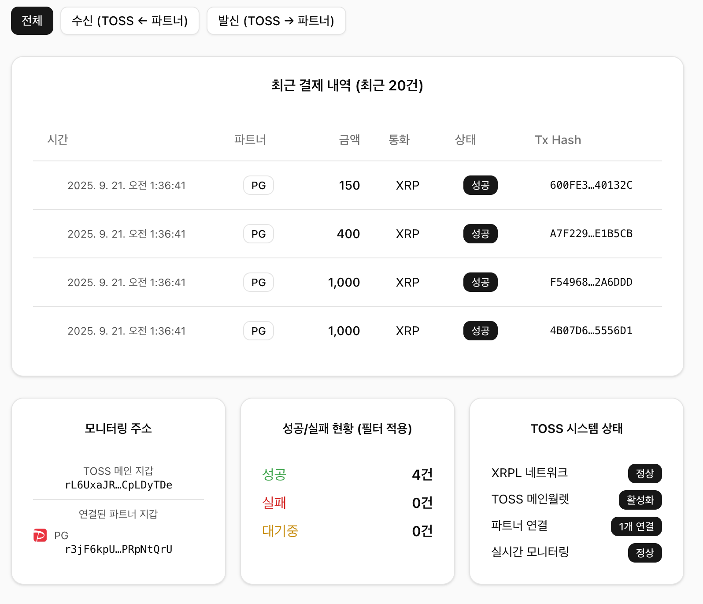

# XRPL Project — XRPL 기반 멀티 레일 결제 PoC

XRPL(XRP Ledger)를 기반으로, 14억 이용자의 국가 간 경계 없는 인증 + 결제 통합 솔루션

 <br>

## 1) 데모 영상 (Audio 포함)


## 2) UI 스크린샷
결제 화면 예시<br>
 <br>
대시보드 예시 <br>


 <br>

## 3) 프로젝트가 XRPL을 활용하는 방식

이 레포는 세 가지 층으로 XRPL과 상호작용합니다.

- 앱(Next.js, `app/`): 최종 사용자의 결제 요청을 받아 XRPL 결제를 수행
  - `app/src/lib/xrplPayment.ts`
    - `sendXRPPayment()`: XRP 결제 — drops 변환(1 XRP = 1,000,000 drops), `account_info`로 예치금(Reserve) 고려한 가용잔액 검증, `autofill → sign → submitAndWait` 흐름
    - `sendIOUPayment()`: IOU 결제 — `{currency, issuer, value}` 포맷으로 전송
    - `processPayment()`: 결제 라우팅 — `XRP` vs `*.IOU` 분기 및 토큰 발행자(issuer) 매핑(`getTokenIssuer`)
  - `app/src/app/UserPayment.tsx`
    - 사용자가 금액/토큰/시드를 입력 → `processPayment()` 호출 → 결과(성공/실패, 트랜잭션 해시 등) 표시
  - 환경변수 예시: `app/env.token.example`

- 토큰 발행(ISSUER, `app/`): Admin 계정이 IOU(USD/JPY/KRW)를 발행하고, 사용자는 TrustLine을 설정
  - `app/src/lib/adminTokenIssuer.ts`
    - `setupTrustLine()`: 사용자의 `TrustSet` 트랜잭션 생성/전송
    - `issueToken()`: Admin → 사용자로 IOU `Payment`
    - `completeTokenIssuanceProcess()`: Admin 정보 확인 → 모든 통화 TrustLine 설정 → 성공한 통화만 선별 발행

- 대시보드(Vite/React, `dashboard/`): XRPL 연결/잔액/거래 조회, TrustLine/유동성/결제 데모 액션, 간단 모니터링
  - `dashboard/src/lib/xrplService.ts`: `Client` 연결 관리, `account_tx` 조회, 변환 유틸
  - `dashboard/src/dashboard.tsx`: TrustLine 생성(`TrustSet`), IOU 결제(`Payment`) 실행 핸들러 포함
  - 환경변수 예시: `dashboard/env.example`


## 4) 레포지토리 구조

```text
XRPL_Project/
├─ app/                      # Next.js 앱 (결제 UI/로직)
│  ├─ src/lib/xrplPayment.ts # XRP/IOU 결제 구현, 가용잔액·Reserve 고려
│  ├─ src/lib/adminTokenIssuer.ts # TrustLine/IOU 발행(ISSUER) 로직
│  ├─ src/app/UserPayment.tsx # 결제 UI → processPayment 호출
│  ├─ XRPL_PAYMENT_README.md
│  └─ env.token.example
├─ dashboard/                # Vite/React 대시보드 (모니터링/데모 액션)
│  ├─ src/lib/xrplService.ts
│  ├─ src/dashboard.tsx
│  └─ XRPL_INTEGRATION_README.md
├─ initialization/           # 초기화/PoC 스크립트
│  ├─ createNewWallet.ts     # XRPL 새 지갑 생성
│  └─ PoC_toss_paypay.ts     # 신뢰선/발행/결제 PoC 루틴
└─ README.md                 # 현재 문서
```


## 5) 빠른 시작 (Windows cmd 기준)

사전 요구사항: Node.js 18+ 권장, npm

1) 의존성 설치

```bat
cd app && npm install && cd ..
cd dashboard && npm install && cd ..
cd initialization && npm install && cd ..
```

2) 환경변수 설정

```bat
REM 앱 토큰/발행자 샘플 복사
copy app\env.token.example app\.env

REM 대시보드 샘플 복사
copy dashboard\env.example dashboard\.env
```

- `app/.env` 주요 항목
  - `ADMIN_SEED` (토큰 발행자) / `USER_SEED` (수신자) — 테스트넷 시드
  - `NEXT_PUBLIC_TOSS_WALLET_ADDRESS`, `NEXT_PUBLIC_PAYPAY_WALLET_ADDRESS`
  - `NEXT_PUBLIC_USD_ISSUER_ADDRESS`, `NEXT_PUBLIC_KRW_ISSUER_ADDRESS`, `NEXT_PUBLIC_JPY_ISSUER_ADDRESS`

- `dashboard/.env` 주요 항목
  - `VITE_XRPL_TESTNET_URL=wss://s.devnet.rippletest.net:51233`
  - `VITE_TOSS_WALLET_SEED` 및 파트너 지갑 시드(테스트용)
  - `VITE_LIVE_MODE=true`로 실제 XRPL Testnet 조회

3) 앱/대시보드 실행

```bat
cd app && npm run dev
```

```bat
cd dashboard && npm run dev
```

- 기본 포트(변경 가능): 앱 `http://localhost:3000`, 대시보드 `http://localhost:5173`


## 6) 데모 시나리오 가이드

- 결제(XRP)
  1. 앱에서 `XRP` 선택, 금액 입력, 사용자 시드 입력
  2. 전송 후 성공 메시지와 `txHash` 확인
  3. Explorer 링크: `https://testnet.xrpl.org/transactions/{txHash}` 열어 확인

- 결제(IOU)
  1. (사전) 사용자 계정에 해당 통화의 TrustLine 필요 — 대시보드에서 `TrustSet` 실행
  2. 앱에서 `USD.IOU`(또는 KRW/JPY) 선택 후 결제
  3. Explorer에서 발행자/통화/금액 확인

- 대시보드 모니터링
  1. `Connect`로 테스트넷 연결 → `account_tx` 로드
  2. 파트너 필터링/차트 확인, 최근 결제 리스트 확인
  3. 필요 시 데모 액션(TrustLine 생성, 초기 유동성 전송, IOU 결제) 수행


## 7) 보안/운영 고려사항

- 현재 데모는 테스트넷, 교육용 목적 — 운영 사용 금지
- 시드 직접 입력은 데모용. 운영 시 다음을 권장
  - 하드웨어 지갑(Ledger 등), XUMM/Gem Wallet 등 지갑 연결
  - 서버사이드 키 관리(KMS/Vault), 다중서명(Multisig)
  - 민감 정보는 절대 클라이언트에 보관 금지


## 8) 참고 문서

- 앱 결제 가이드: `app/XRPL_PAYMENT_README.md`
- 토큰 발행 가이드: `app/TOKEN_ISSUER_README.md`
- 대시보드 가이드: `dashboard/XRPL_INTEGRATION_README.md`
- XRPL 공식: `https://xrpl.org/`, JS SDK: `https://js.xrpl.org/`
- XRPL Testnet Explorer: `https://testnet.xrpl.org/`

## 9) 트랜잭션 링크

[지갑 주소: rL6UxaJR8WkyYmDzBtDP14t9vhCpLDyTDe](https://devnet.xrpl.org/accounts/rL6UxaJR8WkyYmDzBtDP14t9vhCpLDyTDe/transactions)

---

문의/이슈는 GitHub Issues로 남겨주세요.
